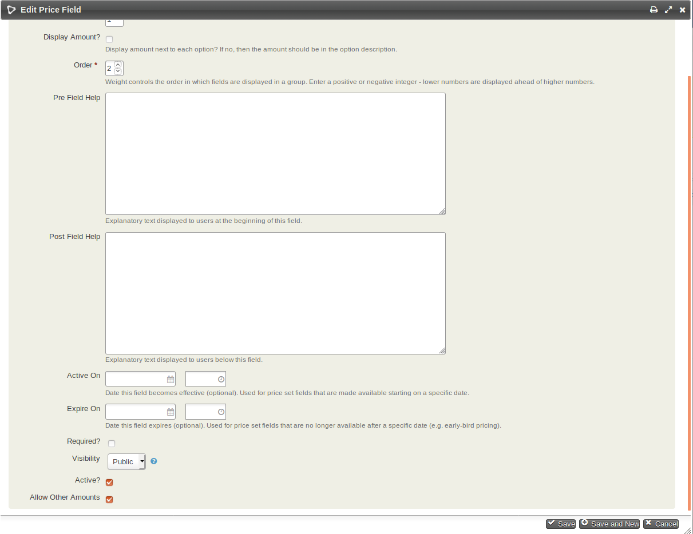

# com.aghstrategies.otheramounts

This Extension:

Adds A "Allow Other Amounts" checkbox to the bottom of the Edit Price Field Form.

IF:
1. The Price Field has the Input Field Type: "Radio"
2. The "Allow Other Amounts" checkbox is checked
3. "Display Amount?" is not checked
4. There is a price option with the label "Other Amount"
5. The price field is used for a Contribution Form

THEN:  

On that Contribution Form an Other Amount box will appear in place of the Other Amount option like below. When the other amount box is clicked the Other Amount will be used instead of whatever other price had been selected.  

